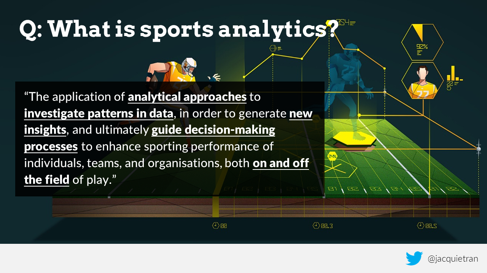

```{r setup, include=FALSE}

knitr::opts_chunk$set(echo = FALSE)

# Load libraries
library(dplyr)
library(ggplot2)
library(ochRe)

```

***

<center></center>

## A general workflow for sports analytics {.build}

Determine the need through collaboration

Articulate the need as a question

Scope out the 'minimum viable product'

Allow time for peer review

Communicate the findings in appropriate ways

# Why use R for sports analytics? | (or similar programming languages)

## Excel: The power and pitfalls of an 'all-in-one' tool {.build}

Data, analysis outputs, and visualisation are stored in one place

Data is easily manipulated - high risk of introducing errors

Point-and-click interface - manual repetition

Actions are not logged

Slow when working with large data sets or files storing many computations

Excel workbooks can 'break' when shared with others

## The case for programming {.build}

Separation of data, analysis outputs, visualisations, and reports

Reproducible and transparent workflow

Procedures are documented via scripts and command history

R is free and open source: users benefit packages created by others

The R community is global and active - lots of help for when you get stuck!

# Demo 1 | Summarising data

## Summarising data

# Demo 2 | Visualising data

## Visualising data

# Demo 3 | Deeper analyses

## Deeper analyses

# Demo 4 | Working with text data

## Working with text data

## Thank you!


<hr />

<center>Dr Jacquie Tran | @jacquietran | https://www.jacquietran.com</center>

# Appendix 1: Learning R

## Starter resources

[Try R](http://tryr.codeschool.com): An in-the-browser tutorial for getting to know the R language - no software installation needed.

['Introduction to R'](www.datacamp.com/courses/free-introduction-to-r): Free course on [Data Camp](https://www.datacamp.com).

['R for Data Science'](http://r4ds.had.co.nz/), by Garrett Grolemund & Hadley Wickham.

['Data wrangling, exploration, and analysis with R'](http://stat545.com/): Course materials from a unit taught at the University of British Columbia by Prof Jenny Bryan.

['R for data analysis and visualisation'](http://www.datacarpentry.org/R-ecology-lesson/index.html): Data Carpentry lesson using ecology data

[The Data Science Guide](http://www.datasciguide.com/find-content-2/): A useful resource for finding content all over the web for learning different data science skills and programming languages. You can tailor your search to your current level of expertise in a given domain.

## Transitioning from Excel to R

['R for Excel Users'](http://blog.shotwell.ca/2017/02/02/r-for-excel-users/): Blog post by Gordon Shotwell

['Introduction to R for Excel Users'](https://tomhopper.me/2016/05/03/r-for-excel-users/): Free ebook by Tom Hopper

# Appendix 2: Sports data sets

## 'Ready to analyse'

[AFLW data](https://github.com/ropenscilabs/ozwomensport/tree/master/AFLW) stored on Github

[ATP and WTA tennis data](https://github.com/skoval/deuce), accessible via the R package `deuce`

[Olympic Sports and Medals, 1896-2014](https://www.kaggle.com/the-guardian/olympic-games/data) collated by The Guardian

[NBA, NFL, MLB, and soccer data](https://github.com/fivethirtyeight/data) from [FiveThirtyEight](https://fivethirtyeight.com)

[NFL play-by-play data](https://github.com/maksimhorowitz/nflscrapR), accessible via the R package `nflscrapR`

MLB data from [Lahman's Baseball Database](http://seanlahman.com/baseball-archive/statistics/)

[Cricket data](https://github.com/ropenscilabs/cricinfo), accessible via the R package `cricinfo`

## Needs scraping / cleaning

[WNBA player and game data](http://www.wnba.com/stats/) from WNBA.com

AFL match statistics from [AFL Tables](https://afltables.com/afl/afl_index.html)

AFL draft and trade data from [Draft Guru](https://www.draftguru.com.au/)

[NCAA men's college basketball data](https://www.sports-reference.com/cbb/) from [Sports Reference](https://www.sports-reference.com)

[NCAA men's college football data](https://www.sports-reference.com/cfb/) from [Sports Reference](https://www.sports-reference.com)

# Other references and resources

## References and resources
